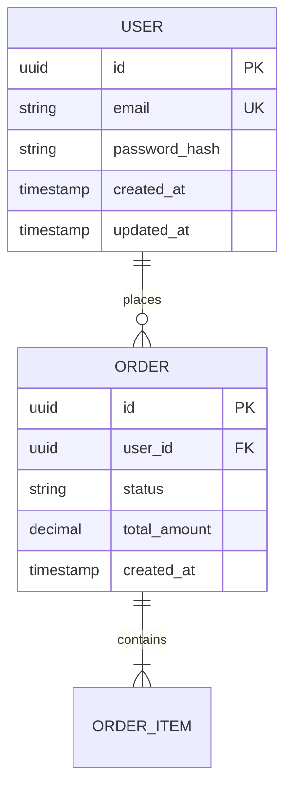
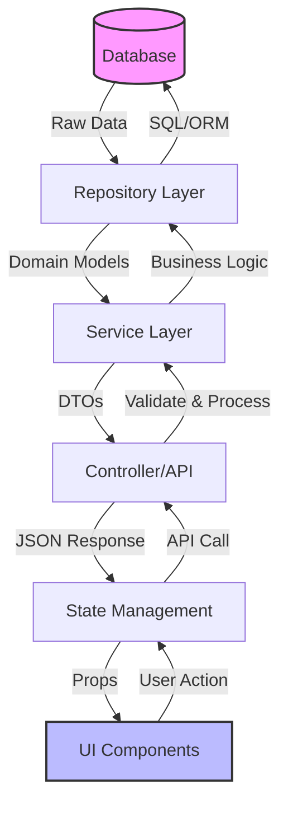

# Data Model Generation Command

Create comprehensive Entity Relationship Diagrams (ERDs) and data documentation for the current project.

## Objective

Generate complete data model documentation including:

1. **Database schemas** - Tables, relationships, constraints, indexes
2. **Service layer models** - DTOs, domain models, business logic data structures
3. **UI data structures** - Component props, state management, data flows

## Output Location

Save all documentation to: `./docs/architecture/data-model.md` (relative to current project directory)

**Important:** Auto-create the `./docs/architecture/` directory if it doesn't exist.

## Discovery Phase

Before generating documentation, perform comprehensive project analysis:

1. **Database Technology Detection**
   - Scan for Prisma schema files (`prisma/schema.prisma`)
   - Check for TypeORM entities (`*.entity.ts`, decorators like `@Entity`)
   - Look for Sequelize models (`models/*.js`, `sequelize.define`)
   - Find Mongoose schemas (`*.model.ts`, `mongoose.Schema`)
   - Detect raw SQL files (`*.sql`, `migrations/*.sql`)
   - Check for Django models (`models.py`)
   - Look for SQLAlchemy models (Python `Base.metadata`)

2. **Backend Framework Detection**
   - Next.js (check `next.config.js`, API routes in `app/api/` or `pages/api/`)
   - Express.js (check `package.json` for express, look for `app.js` or `server.js`)
   - FastAPI (check `requirements.txt`, `main.py` with `@app` decorators)
   - Django (check `settings.py`, `urls.py`)
   - NestJS (check for `@Module`, `@Controller` decorators)

3. **Frontend State Management Detection**
   - Redux (check for `createSlice`, `configureStore`)
   - Zustand (check for `create` from zustand)
   - Context API (check for `createContext`, `useContext`)
   - React Query (check for `useQuery`, `useMutation`)
   - MobX (check for `makeObservable`, `@observable`)
   - Jotai (check for `atom` from jotai)

4. **Service Layer Patterns**
   - Repository pattern (look for `*.repository.ts`)
   - Service pattern (look for `*.service.ts`)
   - Controller pattern (look for `*.controller.ts`)
   - Use cases (look for `*.usecase.ts`)

## Generation Process

Create a comprehensive single-file documentation at `./docs/architecture/data-model.md` with the following structure:

---

# Data Model Documentation

> Generated on: [DATE]
> Project: [PROJECT_NAME]
> Tech Stack: [AUTO-DETECTED STACK]

## Table of Contents

1. Database Schema ERD
2. Service Layer Models
3. UI Data Structures
4. End-to-End Data Flow

---

## 1. Database Schema ERD

### Overview

[Brief description of the database architecture]

### Entity Relationship Diagram



### Table Definitions

#### [Table 1 Name]

- **Purpose:** [Brief description]
- **Columns:**
  - `id` (UUID, PRIMARY KEY) - Unique identifier
  - `email` (VARCHAR(255), UNIQUE, NOT NULL) - User email address
  - `created_at` (TIMESTAMP, DEFAULT NOW()) - Creation timestamp
  - [... all columns with types and constraints]
- **Indexes:**
  - `idx_email` on `email` (unique)
  - `idx_created_at` on `created_at`
- **Foreign Keys:**
  - None / [list foreign keys]
- **Notes:** [Any special considerations]

[Repeat for all tables]

---

## 2. Service Layer Models

### Overview

[Description of service layer architecture]

### Data Transfer Objects (DTOs)

#### Request DTOs

**CreateUserDTO**

```typescript
interface CreateUserDTO {
  email: string; // Valid email format
  password: string; // Min 8 chars, 1 uppercase, 1 number
  firstName?: string;
  lastName?: string;
}
```

**Validation Rules:**

- `email`: Required, valid email format
- `password`: Required, min 8 characters, must contain uppercase, number
- `firstName`: Optional, max 50 characters
- `lastName`: Optional, max 50 characters

[Continue for all DTOs]

#### Response DTOs

**UserResponseDTO**

```typescript
interface UserResponseDTO {
  id: string;
  email: string;
  firstName: string | null;
  lastName: string | null;
  createdAt: string; // ISO 8601 format
  updatedAt: string;
}
```

[Continue for all response DTOs]

### Domain Models

**User Domain Model**

```typescript
class User {
  private id: string;
  private email: string;
  private passwordHash: string;

  // Business logic methods
  public verifyPassword(plaintext: string): boolean;
  public updateEmail(newEmail: string): void;
}
```

**Business Rules:**

- Email must be unique across system
- Password changes require current password verification
- Deleted users retain data for 30 days (soft delete)

[Continue for all domain models]

---

## 3. UI Data Structures

### Overview

[Description of frontend data architecture]

### Component Props

**UserProfile Component**

```typescript
interface UserProfileProps {
  user: {
    id: string;
    email: string;
    firstName: string | null;
    lastName: string | null;
  };
  onUpdate: (data: Partial<UpdateUserDTO>) => Promise<void>;
  isLoading: boolean;
}
```

[Continue for major components]

### State Management Schemas

**User State (Redux/Zustand/etc.)**

```typescript
interface UserState {
  currentUser: User | null;
  isAuthenticated: boolean;
  isLoading: boolean;
  error: string | null;
}
```

**Actions:**

- `loginUser(credentials)` - Authenticate user
- `logoutUser()` - Clear session
- `updateUserProfile(data)` - Update user data

[Continue for all state slices]

### Form Schemas

**User Registration Form**

```typescript
interface RegistrationFormSchema {
  email: string;
  password: string;
  confirmPassword: string;
  firstName?: string;
  lastName?: string;
  agreeToTerms: boolean;
}
```

**Validation:**

- Client-side: Zod/Yup schema validation
- Server-side: DTO validation
- Real-time field validation on blur

---

## 4. End-to-End Data Flow

### Overview

Complete data flow from database through API to UI and back.

### Data Flow Diagram



### Example Flow: User Registration

**1. User submits registration form (UI)**

```typescript
// Component
const handleSubmit = async (formData: RegistrationFormSchema) => {
  await registerUser(formData);
};
```

**2. API call dispatched (State Management)**

```typescript
// Action/Mutation
const registerUser = async (data: CreateUserDTO) => {
  const response = await fetch("/api/users/register", {
    method: "POST",
    body: JSON.stringify(data),
  });
  return response.json();
};
```

**3. API endpoint receives request (Controller)**

```typescript
// POST /api/users/register
async function handleRegister(req: Request) {
  const dto = validateDTO(CreateUserDTO, req.body);
  const user = await userService.createUser(dto);
  return UserResponseDTO.from(user);
}
```

**4. Business logic executed (Service)**

```typescript
// UserService
async createUser(dto: CreateUserDTO): Promise<User> {
  // Hash password
  const passwordHash = await bcrypt.hash(dto.password, 10);

  // Create user via repository
  const user = await userRepository.create({
    email: dto.email,
    passwordHash,
    firstName: dto.firstName,
    lastName: dto.lastName
  });

  return user;
}
```

**5. Database operation (Repository)**

```typescript
// UserRepository
async create(data: CreateUserData): Promise<User> {
  return await db.user.create({
    data: {
      id: uuid(),
      email: data.email,
      passwordHash: data.passwordHash,
      firstName: data.firstName,
      lastName: data.lastName,
      createdAt: new Date(),
      updatedAt: new Date()
    }
  });
}
```

**Data Transformations:**

- **UI Form** → **CreateUserDTO** (client-side validation)
- **CreateUserDTO** → **Domain Model** (service layer)
- **Domain Model** → **Database Entity** (repository layer)
- **Database Entity** → **Domain Model** (on read)
- **Domain Model** → **UserResponseDTO** (API response)
- **UserResponseDTO** → **UI State** (state management)

[Repeat for other critical flows: Authentication, CRUD operations, etc.]

---

## Data Validation Strategy

### Client-Side Validation

- Form validation using Zod/Yup/Joi
- Real-time feedback on input
- TypeScript type safety

### Server-Side Validation

- DTO validation (class-validator or similar)
- Business rule validation in service layer
- Database constraint validation

### Database Constraints

- Primary keys (UUID)
- Foreign keys (referential integrity)
- Unique constraints
- Check constraints
- Not null constraints

---

## Notes and Considerations

### Performance Optimization

- Database indexes on frequently queried columns
- Lazy loading for large datasets
- Pagination for list endpoints
- Caching strategy (Redis, etc.)

### Security Considerations

- Password hashing (bcrypt, argon2)
- SQL injection prevention (ORM parameterization)
- XSS prevention (output sanitization)
- CSRF protection
- Rate limiting on API endpoints

### Future Enhancements

- [List planned changes to data model]
- [Migrations planned]
- [New entities/features]

---

## Output Format Instructions

1. **Use Mermaid syntax** for all diagrams (ERD and flowcharts)
2. **Include TypeScript interfaces** where applicable (even for non-TS projects, use TS syntax for clarity)
3. **Document all relationships** between entities
4. **Include validation rules** for all DTOs and forms
5. **Add notes** for complex business logic or special cases
6. **Be comprehensive** - include all tables, models, and major components
7. **Keep it updated** - regenerate when schema changes

## Technology-Specific Instructions

### For Prisma Projects

- Parse `prisma/schema.prisma` file
- Extract all models with fields, relations, indexes
- Document enums and custom types

### For TypeORM Projects

- Scan for `*.entity.ts` files
- Parse decorators: `@Entity`, `@Column`, `@ManyToOne`, etc.
- Document relationships and cascade options

### For Sequelize Projects

- Find model definitions in `models/` directory
- Parse `sequelize.define()` calls
- Document associations (hasMany, belongsTo, etc.)

### For Mongoose Projects

- Scan for `*.model.ts` or `*.schema.ts` files
- Parse `mongoose.Schema()` definitions
- Document virtual fields and methods

### For Django Projects

- Parse `models.py` files
- Extract Django model classes with fields
- Document relationships (ForeignKey, ManyToMany, etc.)

### For Next.js Projects

- Check both App Router (`app/api/`) and Pages Router (`pages/api/`)
- Document Server Components data fetching
- Include Client Component state patterns

## Execution Steps

1. Create `./docs/architecture/` directory if it doesn't exist
2. Scan project for database schema files
3. Identify all entities/tables
4. Parse relationships and constraints
5. Scan for service layer patterns
6. Identify DTOs and domain models
7. Scan frontend for component props and state management
8. Generate comprehensive single-file documentation
9. Save to `./docs/architecture/data-model.md`
10. Confirm successful creation

## Success Criteria

✅ Single comprehensive file created at `./docs/architecture/data-model.md`
✅ All database entities documented with Mermaid ERD
✅ All service layer models documented (DTOs, domain models)
✅ All UI data structures documented (props, state)
✅ End-to-end data flow documented with diagrams
✅ Validation rules included for all data structures
✅ Technology stack auto-detected and documented
✅ File is well-organized and easy to navigate
