# Bug Diagnosis and Fix Command

Intelligently diagnose and fix bugs by:

1. **Adding diagnostic instrumentation** to capture current behavior
2. **Deep architecture analysis** using `/docs/architecture/data-model.md`
3. **Hypothesis generation** (5-7 possible sources, distilled to 1-2 most likely)
4. **User confirmation** before implementing fix
5. **Root cause documentation** for cross-project memory

## Current Bug Report

**User Input:** `$ARGUMENTS`

Please diagnose and fix the bug described above using the complete workflow outlined in this document.

## Command Usage

```bash
/fix "payment processing fails for subscriptions"
/fix "null pointer error in user service"
/fix "UI not updating after API call"
```

## Execution Flow

```mermaid
flowchart TD
    START[User Reports Bug] --> CHECK{data-model.md exists?}
    CHECK -->|No| GEN[Generate data-model.md]
    CHECK -->|Yes| READ[Read architecture docs]
    GEN --> READ

    READ --> CONTEXT[Gather bug context]
    CONTEXT --> LOGS[Add diagnostic logs/instrumentation]

    LOGS --> REPRODUCE[Attempt to reproduce bug]
    REPRODUCE --> ANALYZE[Analyze log output]

    ANALYZE --> HYPOTHESIS[Generate 5-7 hypotheses]
    HYPOTHESIS --> DISTILL[Distill to 1-2 most likely causes]

    DISTILL --> VALIDATE[Validate with diagnostic data]
    VALIDATE --> PRESENT[Present diagnosis to user]

    PRESENT --> CONFIRM{User confirms diagnosis?}
    CONFIRM -->|No| LOGS
    CONFIRM -->|Yes| FIX[Implement fix]

    FIX --> TEST[Test fix thoroughly]
    TEST --> VERIFY[Verify bug resolved]

    VERIFY --> CLEANUP[Remove diagnostic logs]
    CLEANUP --> DOCS[Document root cause]
    DOCS --> MEMORY[Write to cross-project memory]

    MEMORY --> COMPLETE[✅ Bug Fixed]

    style START fill:#fbb,stroke:#333,stroke-width:2px
    style COMPLETE fill:#bfb,stroke:#333,stroke-width:2px
    style CONFIRM fill:#ffb,stroke:#333,stroke-width:2px
```



## Phase 1: Context Gathering & Architecture Analysis (5-10 min)

### Step 1.1: Check for Data Model Documentation

```typescript
const dataModelPath = "./docs/architecture/data-model.md";
const exists = await fileExists(dataModelPath);

if (!exists) {
  console.log("⚠️  Architecture documentation missing");
  console.log("📝 Generating data-model.md for context...");
  await executeCommand("data-model");
  console.log("✅ Data model documentation created");
}
```

### Step 1.2: Read Architecture for Context

Deep analysis of architecture to understand bug context:

**Database Layer Analysis**:

- Read ERD and entity relationships
- Understand foreign key constraints
- Check indexes and query patterns
- Identify potential N+1 query scenarios
- Review validation rules and constraints

**Service Layer Analysis**:

- Understand DTO structures and validation
- Review domain model business logic
- Check data transformation patterns
- Identify error handling approaches
- Analyze dependency injection patterns

**API Layer Analysis**:

- Review endpoint implementations
- Check request/response DTOs
- Understand middleware and error handling
- Analyze authentication/authorization flows
- Review rate limiting and validation

**UI Layer Analysis**:

- Understand component data flows
- Review state management patterns
- Check form validation logic
- Analyze error display mechanisms
- Review data fetching strategies

**Data Flow Analysis**:

- Trace end-to-end data flow for affected feature
- Identify all transformation points
- Check validation at each layer
- Review error propagation
- Understand state synchronization

### Step 1.3: Cross-Project Memory Check

Search for similar bugs in past projects:

```typescript
const failurePatterns = await readJSON("$MEMORY_PATH/failure_patterns.json");

// Search for patterns matching:
const similarBugs = failurePatterns.filter((pattern) => {
  return (
    pattern.technologies.some((tech) => projectTechStack.includes(tech)) ||
    pattern.problem.includes(bugKeywords) ||
    pattern.symptoms.some((symptom) => bugDescription.includes(symptom))
  );
});
```

**Output**:

```
🧠 Cross-Project Memory - Similar Bugs:
✅ Found: n1-query-user-relations-2025-08
   - Symptom: Slow API responses with multiple users
   - Cause: N+1 query pattern in user relationships

⚠️  Found: stripe-webhook-replay-attack-2025-10
   - Symptom: Duplicate payments processed
   - Cause: Missing idempotency check

✅ Found: react-state-stale-closure-2025-09
   - Symptom: UI not updating after state change
   - Cause: Stale closure in useEffect
```

### Step 1.4: Gather Bug Context

Collect comprehensive information about the bug:

**User-Provided Information**:

- Bug description
- Steps to reproduce
- Expected behavior
- Actual behavior
- Error messages/stack traces
- Environment (dev/staging/prod)

**System Context** (auto-detected):

- Technology stack
- Affected components (from architecture analysis)
- Related entities and data flows
- Recent code changes (if available via git)

**Create Bug Context Document following documentation standards**:

- **Frontend bugs:** `docs/tasks/frontend/DD-MM-YYYY/<semantic-bug-id>/context.md`
- **Backend bugs:** `docs/tasks/backend/DD-MM-YYYY/<semantic-bug-id>/context.md`

Use semantic bug ID slugs (e.g., `payment-processing-failure`, `ui-state-sync-issue`, `database-connection-timeout`)

Use this template:

@~/.config/opencode/templates/fix-context.md

## Phase 2: Diagnostic Instrumentation (10-15 min)

### Step 2.1: Add Targeted Diagnostic Logs

**CRITICAL**: Add instrumentation FIRST, before attempting fixes.

**Database Layer Diagnostics**:

```typescript
// Add query logging
console.log("[DEBUG] Query executing:", {
  query: "SELECT * FROM users WHERE id = $1",
  params: [userId],
  timestamp: new Date().toISOString(),
});

// Log query results
console.log("[DEBUG] Query result:", {
  rowCount: result.rows.length,
  executionTime: `${endTime - startTime}ms`,
  data: result.rows,
});

// Log relationship loading
console.log("[DEBUG] Loading relationships:", {
  entity: "User",
  relationships: ["orders", "subscriptions"],
  eager: true,
});
```

**Service Layer Diagnostics**:

```typescript
// Add service entry/exit logging
console.log("[DEBUG] Service method called:", {
  service: "UserService",
  method: "updateProfile",
  input: sanitizeForLog(input),
  timestamp: new Date().toISOString(),
});

// Log validation results
console.log("[DEBUG] Validation result:", {
  isValid: validationResult.isValid,
  errors: validationResult.errors,
  input: sanitizeForLog(input),
});

// Log transformations
console.log("[DEBUG] Data transformation:", {
  from: "DTO",
  to: "DomainModel",
  before: sanitizeForLog(dto),
  after: sanitizeForLog(domainModel),
});
```

**API Layer Diagnostics**:

```typescript
// Add request/response logging
console.log("[DEBUG] API request:", {
  method: req.method,
  path: req.path,
  query: req.query,
  body: sanitizeForLog(req.body),
  headers: sanitizeHeaders(req.headers),
});

console.log("[DEBUG] API response:", {
  statusCode: res.statusCode,
  body: sanitizeForLog(responseBody),
  executionTime: `${Date.now() - startTime}ms`,
});

// Log middleware execution
console.log("[DEBUG] Middleware executed:", {
  name: "authMiddleware",
  user: req.user?.id,
  authorized: true,
});
```

**UI Layer Diagnostics**:

```typescript
// Add component state logging
console.log("[DEBUG] Component state:", {
  component: "UserProfile",
  prevState: prevState,
  nextState: nextState,
  trigger: "useEffect",
});

// Log API calls
console.log("[DEBUG] API call initiated:", {
  endpoint: "/api/users/123",
  method: "PATCH",
  payload: sanitizeForLog(payload),
});

// Log state management
console.log("[DEBUG] Store update:", {
  store: "userStore",
  action: "updateProfile",
  prevValue: prevValue,
  nextValue: nextValue,
});
```

**State Flow Diagnostics**:

```typescript
// Log data flow through layers
console.log("[DEBUG] Data flow checkpoint:", {
  layer: "API → Service",
  data: sanitizeForLog(data),
  checkpoint: "before-validation",
});
```

### Step 2.2: Add Error Boundaries and Handlers

```typescript
// Enhanced error logging
try {
  const result = await processPayment(paymentData);
} catch (error) {
  console.error("[DEBUG] Error caught:", {
    location: "PaymentService.processPayment",
    error: {
      name: error.name,
      message: error.message,
      stack: error.stack,
      cause: error.cause,
    },
    input: sanitizeForLog(paymentData),
    context: {
      userId: paymentData.userId,
      amount: paymentData.amount,
      currency: paymentData.currency,
    },
  });
  throw error;
}
```

### Step 2.3: Create Diagnostic Checklist

```markdown
## Diagnostic Instrumentation Added

### Database Layer

- [ ] Query logging with parameters
- [ ] Result logging with row counts
- [ ] Execution time tracking
- [ ] Relationship loading logs

### Service Layer

- [ ] Service method entry/exit
- [ ] Validation result logging
- [ ] Data transformation logs
- [ ] Business logic checkpoints

### API Layer

- [ ] Request/response logging
- [ ] Middleware execution logs
- [ ] Error handling logs
- [ ] Performance timing

### UI Layer

- [ ] Component state changes
- [ ] API call tracking
- [ ] Store updates
- [ ] Re-render triggers

### Cross-Cutting

- [ ] Error boundaries
- [ ] Data flow checkpoints
- [ ] Security-safe log sanitization
```

## Phase 3: Reproduce & Analyze (10-15 min)

### Step 3.1: Attempt to Reproduce Bug

```markdown
## Reproduction Attempt

### Steps Executed

1. [Step 1 with exact parameters]
2. [Step 2 with exact parameters]
3. [Step 3 with exact parameters]

### Environment

- Database state: [Initial state]
- User context: [User ID, permissions]
- External dependencies: [API status, service availability]

### Reproduction Result

✅ Bug reproduced successfully
❌ Unable to reproduce (document why)
⚠️ Partial reproduction (document differences)
```

### Step 3.2: Collect Diagnostic Output

Save all diagnostic logs following documentation standards:

- **Frontend bugs:** `docs/tasks/frontend/DD-MM-YYYY/<semantic-bug-id>/diagnostic-logs.md`
- **Backend bugs:** `docs/tasks/backend/DD-MM-YYYY/<semantic-bug-id>/diagnostic-logs.md`

Use this template:

@~/.config/opencode/templates/fix-diagnostic-logs.md

### Step 3.3: Analyze Diagnostic Data
Review logs to identify patterns:

**Data Flow Analysis**:
- Where does data enter the system?
- How is it transformed at each layer?
- Where does the error first occur?
- What data is missing or malformed?

**Timing Analysis**:
- Performance bottlenecks identified?
- Timeout issues?
- Race conditions?

**State Analysis**:
- What is the state before error?
- What state change triggers error?
- Is state synchronized across layers?

## Phase 4: Hypothesis Generation & Distillation (10-15 min)

### Step 4.1: Generate 5-7 Hypotheses

Based on diagnostic data, architecture analysis, and cross-project memory, generate comprehensive list of possible causes:

```markdown
## Hypothesis Generation

### Hypothesis 1: N+1 Query Problem
**Likelihood**: 🔴 High
**Evidence**:
- Diagnostic logs show sequential queries
- User entity loaded without relationships
- Performance degrades with more records
- Pattern matches failure-pattern: n1-query-user-relations-2025-08

**Data Flow Point**: Database → Service layer
**Affected Layer**: Repository/ORM

---

### Hypothesis 2: Missing Validation
**Likelihood**: 🟡 Medium
**Evidence**:
- Error occurs after validation passes
- Null/undefined error suggests missing check
- DTO validation doesn't check relationship existence

**Data Flow Point**: Service layer validation
**Affected Layer**: DTO validation

---

### Hypothesis 3: Race Condition
**Likelihood**: 🟡 Medium
**Evidence**:
- Intermittent failure (20% of requests)
- Timing logs show variable execution order
- Async operations not properly awaited

**Data Flow Point**: Async service calls
**Affected Layer**: Service orchestration

---

### Hypothesis 4: Stale Cache
**Likelihood**: 🟢 Low
**Evidence**:
- Works after service restart
- Some users affected, others not
- Caching layer detected in stack

**Data Flow Point**: Cache → Database
**Affected Layer**: Caching middleware

---

### Hypothesis 5: State Synchronization (UI)
**Likelihood**: 🟡 Medium (if UI bug)
**Evidence**:
- UI shows stale data
- API returns correct data
- State update logs show closure issue
- Pattern matches: react-state-stale-closure-2025-09

**Data Flow Point**: API → UI State
**Affected Layer**: Frontend state management

---

### Hypothesis 6: Transaction Isolation
**Likelihood**: 🟢 Low
**Evidence**:
- Concurrent requests show different results
- Database isolation level: READ_COMMITTED
- Phantom read possible

**Data Flow Point**: Database transactions
**Affected Layer**: Database

---

### Hypothesis 7: Authentication/Authorization Issue
**Likelihood**: 🟢 Low
**Evidence**:
- Works for admin users
- Fails for regular users
- Permission check logs unclear

**Data Flow Point**: Middleware → Service
**Affected Layer**: Authorization middleware
````

### Step 4.2: Distill to 1-2 Most Likely Causes

Apply systematic analysis to narrow down:

**Distillation Criteria**:

1. **Evidence Strength**: How much diagnostic data supports this?
2. **Architecture Alignment**: Does data-model.md confirm this pattern?
3. **Cross-Project Memory**: Have we seen this exact pattern before?
4. **Data Flow Analysis**: Does timeline support this hypothesis?
5. **Probability**: Based on error type and context

```markdown
## Distilled Root Causes

### Primary Hypothesis: N+1 Query Problem (90% confidence)

**Why this is most likely**:
✅ Diagnostic logs show sequential queries (User → Subscription → Payment)
✅ Architecture analysis confirms no eager loading in UserRepository
✅ Cross-project memory shows identical pattern: n1-query-user-relations-2025-08
✅ Error occurs exactly at point where subscription relationship accessed
✅ Performance metrics show query count = number of users + 1

**Evidence from data-model.md**:

- User entity has `@relation` to Subscription (Prisma)
- No `include: { subscription: true }` in repository queries
- Service layer expects subscription to be loaded

**Data Flow Breakdown**:
```

1. API receives request (T+0ms)
2. Service calls UserRepository.findById(userId) (T+15ms)
   → Query 1: SELECT \* FROM users WHERE id = $1
3. Service accesses user.subscription (T+23ms)
   → Query 2: SELECT \* FROM subscriptions WHERE user_id = $1 ❌ NOT EXECUTED
4. Error: Cannot read property 'subscription_id' of undefined (T+45ms)

```

**Fix Strategy**:
- Add eager loading: `include: { subscription: true }` in repository
- OR: Modify service to handle lazy loading
- OR: Use explicit join in query

---

### Secondary Hypothesis: Missing Null Check (10% confidence)

**Why this is possible (but less likely)**:
⚠️  Error message suggests undefined access
⚠️  DTO validation doesn't check subscription existence
❌ Doesn't explain why it works sometimes
❌ Doesn't match timing pattern in logs

**If Primary Fix Doesn't Work**:
Add validation: `if (!user.subscription) throw new ValidationError(...)`
```

### Step 4.3: Validate Hypotheses with Diagnostic Data

Cross-reference distilled hypotheses with diagnostic logs:

```markdown
## Hypothesis Validation

### Testing Primary Hypothesis: N+1 Query

**Diagnostic Evidence Check**:
✅ Log line 45: "Query executing: SELECT _ FROM users WHERE id = $1"
✅ Log line 67: "Accessing user.subscription"
✅ Log line 68: ERROR - "Cannot read property 'subscription_id' of undefined"
❌ No log for: "SELECT _ FROM subscriptions WHERE user_id = $1"

**Conclusion**: Hypothesis validated - subscription never loaded from database

---

### Testing Secondary Hypothesis: Missing Null Check

**Diagnostic Evidence Check**:
⚠️ Validation passed but didn't check subscription
⚠️ Could prevent error but doesn't explain root cause

**Conclusion**: Valid defensive measure but not root cause
```

## Phase 5: User Confirmation (CRITICAL - MANDATORY)

### Step 5.1: Present Diagnosis to User

**STOP HERE** - Do NOT implement fix until user confirms

Use this template for the diagnosis report:

@~/.config/opencode/templates/fix-diagnosis-report.md

### Step 5.2: Wait for User Response

**DO NOT PROCEED** until user explicitly confirms:
- ✅ "Yes, fix it"
- ✅ "Diagnosis looks correct, proceed"
- ✅ "Implement the fix"

**If user provides additional context**:
- Update diagnostic logs
- Re-run hypothesis generation
- Present updated diagnosis

**If user says diagnosis is wrong**:
- Ask for specific feedback
- Add more targeted diagnostics
- Re-analyze with new information

## Phase 6: Implement Fix (ONLY AFTER CONFIRMATION)

### Step 6.1: Create Fix Implementation Plan

```markdown
# Fix Implementation Plan

## Changes Required

### 1. Repository Layer
**File**: `src/repositories/user.repository.ts`
**Lines**: 25-30
**Change**: Add eager loading for subscription relationship

### 2. Service Layer (Defensive)
**File**: `src/services/payment.service.ts`
**Lines**: 45-47
**Change**: Add null check for subscription

### 3. Tests
**Files**:
- `src/repositories/user.repository.test.ts` (add eager loading tests)
- `src/services/payment.service.test.ts` (add null subscription tests)

### 4. Documentation
**File**: `docs/architecture/data-model.md`
**Change**: Document eager loading pattern for User queries

## Risk Assessment
- **Risk Level**: Low
- **Affected Users**: All subscription users
- **Rollback Plan**: Revert single commit
- **Testing Required**: Unit + Integration tests
````

### Step 6.2: Implement Fix with Tests

**Repository Fix**:

```typescript
// src/repositories/user.repository.ts
async findById(userId: string): Promise<User | null> {
  return await this.db.user.findUnique({
    where: { id: userId },
    include: {
      subscription: true // ✅ FIX: Eager load subscription
    }
  });
}
```

**Service Defensive Check**:

```typescript
// src/services/payment.service.ts
async processSubscriptionPayment(userId: string, amount: number) {
  const user = await this.userRepository.findById(userId);

  if (!user) {
    throw new NotFoundError('User not found');
  }

  // ✅ FIX: Add defensive null check
  if (!user.subscription) {
    throw new ValidationError('User does not have an active subscription');
  }

  const subscriptionId = user.subscription.subscription_id;
  // ... process payment
}
```

**Tests**:

```typescript
// src/repositories/user.repository.test.ts
describe("UserRepository.findById", () => {
  it("should load subscription relationship", async () => {
    const user = await repository.findById("user-123");

    expect(user).toBeDefined();
    expect(user.subscription).toBeDefined(); // ✅ Verify eager loading
    expect(user.subscription.subscription_id).toBe("sub-456");
  });
});

// src/services/payment.service.test.ts
describe("PaymentService.processSubscriptionPayment", () => {
  it("should throw error when user has no subscription", async () => {
    // Setup user without subscription
    await expect(
      service.processSubscriptionPayment("user-no-sub", 100),
    ).rejects.toThrow("User does not have an active subscription");
  });
});
```

### Step 6.3: Remove Diagnostic Logs

**IMPORTANT**: Clean up diagnostic instrumentation added in Phase 2

```markdown
## Diagnostic Cleanup Checklist

### Files Modified for Diagnostics

- [ ] `src/repositories/user.repository.ts` - Remove debug logs
- [ ] `src/services/payment.service.ts` - Remove debug logs
- [ ] `app/api/payments/route.ts` - Remove debug logs

### Cleanup Verification

- [ ] No `console.log('[DEBUG]` statements remain
- [ ] No temporary error handlers added
- [ ] No performance timing code left
- [ ] Original error handling restored
```

**Keep only**:

- Existing production logging
- New defensive null checks (these are permanent improvements)

## Phase 7: Testing & Verification (10-15 min)

### Step 7.1: Test Fix Locally

```bash
# Run affected tests
npm test -- user.repository.test.ts
npm test -- payment.service.test.ts

# Run integration tests
npm test -- payment.integration.test.ts

# Build verification
npm run build

# Type checking
npm run type-check
```

### Step 7.2: Verify Bug Resolution

Reproduce original bug scenario:

```markdown
## Verification Report

### Original Bug Scenario

1. User with subscription_id: sub-456
2. Attempt payment processing
3. Expected: Payment processes successfully
4. Previous Result: Error "Cannot read property 'subscription_id' of undefined"

### After Fix

1. User with subscription_id: sub-456
2. Attempt payment processing
3. Result: ✅ Payment processed successfully
4. Subscription loaded: ✅ Yes
5. Error: ❌ None

### Edge Cases Tested

- [ ] User without subscription → Proper validation error
- [ ] User with cancelled subscription → Handled correctly
- [ ] Multiple concurrent requests → No race condition
- [ ] Null/undefined userId → Proper error handling

### Performance Impact

- Before: 1 query per user (missing relationship)
- After: 1 query per user (with join)
- Impact: Minimal (same query count, better result)
```

### Step 7.3: Automated Test Suite

```bash
# Run full test suite
npm test

# Expected results:
✅ All existing tests pass
✅ New tests for fix pass
✅ No regressions detected
```

## Phase 8: Documentation & Memory (10 min)

### Step 8.1: Update data-model.md

If pattern or best practice identified, update architecture docs:

````markdown
## User Entity Query Patterns

### ⚠️ Important: Always Eager Load Relationships

When querying User entities in payment context, ALWAYS include subscription:

```typescript
// ✅ CORRECT
const user = await userRepository.findById(userId, {
  include: { subscription: true },
});

// ❌ INCORRECT - Will cause errors in payment processing
const user = await userRepository.findById(userId);
```
````

**Why**: Payment service requires subscription data. Lazy loading causes undefined access errors.

````

### Step 8.2: Create Bug Resolution Document

Create resolution document following documentation standards:
- **Frontend bugs:** `docs/tasks/frontend/DD-MM-YYYY/<semantic-bug-id>/resolution.md`
- **Backend bugs:** `docs/tasks/backend/DD-MM-YYYY/<semantic-bug-id>/resolution.md`

Use this template:

@~/.config/opencode/templates/fix-resolution.md

### Step 8.3: Write to Cross-Project Memory

**Evaluate**: Is this bug reusable knowledge for other projects?

**Write to `$MEMORY_PATH/failure_patterns.json`**:

```json
{
  "id": "orm-missing-eager-loading-2025-10",
  "date": "2025-10-26",
  "problem": "ORM relationship access fails with undefined error due to missing eager loading",
  "symptoms": [
    "Cannot read property 'X' of undefined when accessing relationships",
    "Works in some contexts but not others",
    "Error occurs when accessing nested relationship properties",
    "Relationship exists in database but not loaded in object"
  ],
  "root_cause": "ORM lazy loading by default - relationships not loaded unless explicitly included. Accessing relationship without eager loading or explicit load causes undefined access.",
  "solution": "Add eager loading to repository queries: include/relations/populate depending on ORM. For frequently accessed relationships, add to default query. For context-specific needs, create dedicated repository methods.",
  "technologies": ["Prisma", "TypeORM", "Sequelize", "Mongoose", "ORM"],
  "prevention": "1. Document relationship loading patterns in data-model.md. 2. Add tests verifying relationships are loaded. 3. Use TypeScript strict mode to catch undefined access. 4. Add defensive null checks in services.",
  "detection": "Add diagnostic logs showing query execution and result structure. Check if relationship query executed. Verify object structure matches expectations.",
  "similar_patterns": [
    "n1-query-user-relations-2025-08",
    "lazy-loading-unexpected-behavior"
  ]
}
```

**Update files-edited.md**:

```markdown
## Cross-Project Memory Updates

### Failure Patterns

- Added: orm-missing-eager-loading-2025-10
  - ORM relationship access pattern and fix
  - Diagnostic approach for lazy loading issues
  - Prevention strategies for future projects
```

## Phase 9: Final Verification & Cleanup

### Step 9.1: Create TodoWrite Summary

```typescript
await todoWrite([
  {
    id: "gather-context",
    content: "Gather bug context and read data-model.md",
    status: "completed",
    priority: "high",
  },
  {
    id: "add-diagnostics",
    content: "Add diagnostic logs and instrumentation",
    status: "completed",
    priority: "high",
  },
  {
    id: "reproduce-bug",
    content: "Reproduce bug and collect diagnostic data",
    status: "completed",
    priority: "high",
  },
  {
    id: "generate-hypotheses",
    content: "Generate 5-7 hypotheses for root cause",
    status: "completed",
    priority: "high",
  },
  {
    id: "distill-causes",
    content: "Distill to 1-2 most likely causes",
    status: "completed",
    priority: "high",
  },
  {
    id: "user-confirmation",
    content: "Present diagnosis and get user confirmation",
    status: "completed",
    priority: "high",
  },
  {
    id: "implement-fix",
    content: "Implement fix with tests",
    status: "completed",
    priority: "high",
  },
  {
    id: "verify-fix",
    content: "Test and verify bug resolution",
    status: "completed",
    priority: "high",
  },
  {
    id: "cleanup-diagnostics",
    content: "Remove diagnostic instrumentation",
    status: "completed",
    priority: "medium",
  },
  {
    id: "update-docs",
    content: "Update data-model.md and create resolution doc",
    status: "completed",
    priority: "high",
  },
  {
    id: "update-memory",
    content: "Write learnings to cross-project memory",
    status: "completed",
    priority: "medium",
  },
]);
```

### Step 9.2: Final Checklist

```markdown
## Bug Fix Completion Checklist

### Diagnosis Phase

- [x] Architecture documentation read (data-model.md)
- [x] Cross-project memory checked for similar bugs
- [x] Bug context gathered and documented
- [x] Diagnostic instrumentation added
- [x] Bug reproduced successfully
- [x] Diagnostic data collected

### Hypothesis Phase

- [x] 5-7 hypotheses generated
- [x] Hypotheses distilled to 1-2 most likely
- [x] Validation with diagnostic data completed
- [x] Diagnosis presented to user
- [x] User confirmed diagnosis

### Fix Phase

- [x] Fix implemented with tests
- [x] All tests passing
- [x] No regressions detected
- [x] Diagnostic logs removed
- [x] Bug verified as resolved

### Documentation Phase

- [x] data-model.md updated with pattern
- [x] Resolution document created
- [x] files-edited.md created
- [x] Cross-project memory updated

### Quality Gates

- [x] Fix follows existing patterns
- [x] Tests cover edge cases
- [x] Documentation is complete
- [x] No performance degradation
```

## Success Criteria

- [x] **Diagnostic-First Approach**: Instrumentation added BEFORE fix
- [x] **Hypothesis Generation**: 5-7 hypotheses documented
- [x] **Distillation**: Narrowed to 1-2 most likely causes
- [x] **User Confirmation**: Explicit approval before fix
- [x] **Architecture-Aware**: Used data-model.md for context
- [x] **Memory Integration**: Checked and updated cross-project memory
- [x] **Testing**: Comprehensive tests added
- [x] **Documentation**: Complete resolution documentation
- [x] **Cleanup**: All diagnostic code removed

## Output Example

### Simple Bug

```
🐛 Bug Diagnosis: Null Pointer in User Service

📋 Architecture Check:
✅ Read /docs/architecture/data-model.md
✅ Identified User entity and relationships
✅ Found service layer patterns

🧠 Cross-Project Memory:
⚠️  Similar bug: react-state-stale-closure-2025-09

🔍 Phase 1: Adding Diagnostics
✅ Added 8 diagnostic log points
✅ Added error boundaries
✅ Added state tracking

📊 Phase 2: Reproduction
✅ Bug reproduced (100% success rate)
✅ Diagnostic data collected
✅ Timeline: Error at T+45ms

🎯 Phase 3: Hypothesis Generation

Generated 5 hypotheses:
1. 🔴 Missing eager loading (HIGH)
2. 🟡 Null validation missing (MEDIUM)
3. 🟡 Race condition (MEDIUM)
4. 🟢 Cache issue (LOW)
5. 🟢 Permission issue (LOW)

Distilled to:
PRIMARY: Missing eager loading (90% confidence)
SECONDARY: Null validation (10% confidence)

📝 Diagnosis Report:
┌─────────────────────────────────────────┐
│ Root Cause: Missing Eager Loading      │
│                                         │
│ User.subscription relationship not     │
│ loaded by default. Service expects     │
│ it to exist, causing undefined error.  │
│                                         │
│ Fix: Add include: { subscription: true}│
│ to UserRepository.findById()           │
└─────────────────────────────────────────┘

❓ Does this diagnosis match your understanding?
   [Waiting for user confirmation...]

✅ User confirmed diagnosis

🔧 Implementing Fix:
✅ Updated UserRepository.findById()
✅ Added defensive null check
✅ Added relationship loading tests
✅ All tests passing (47/47)

🧹 Cleanup:
✅ Removed 8 diagnostic log points
✅ Restored original error handling

📝 Documentation:
✅ Updated data-model.md with pattern
✅ Created resolution document
✅ Documented in files-edited.md

🧠 Memory Updated:
✅ Added: orm-missing-eager-loading-2025-10

🎯 Bug Fixed!
```

### Complex Bug

```
🐛 Bug Diagnosis: Payment Processing Intermittent Failures

📋 Architecture Check:
✅ Read /docs/architecture/data-model.md
✅ Analyzed Payment → Subscription → User flow
✅ Identified 3 affected services

🧠 Cross-Project Memory:
⚠️  Similar: stripe-webhook-replay-attack-2025-10
⚠️  Similar: race-condition-async-payment-2025-07
✅ Applied: idempotency-pattern-2025-09

🔍 Phase 1: Adding Diagnostics (15 min)
✅ Added 23 diagnostic log points across 3 layers
✅ Added transaction tracking
✅ Added timing instrumentation
✅ Added state snapshots

📊 Phase 2: Reproduction (20 min)
⚠️  Intermittent: 3 successes, 2 failures in 5 attempts
✅ Diagnostic data collected for both scenarios
✅ Pattern identified: Fails under concurrent load

🎯 Phase 3: Hypothesis Generation

Generated 7 hypotheses:
1. 🔴 Race condition in payment status update (HIGH)
2. 🔴 Missing database transaction isolation (HIGH)
3. 🟡 Webhook replay without idempotency (MEDIUM)
4. 🟡 Cache inconsistency (MEDIUM)
5. 🟢 Network timeout (LOW)
6. 🟢 External API rate limiting (LOW)
7. 🟢 Insufficient error handling (LOW)

Distilled to:
PRIMARY: Race condition (85% confidence)
  - Two concurrent requests update same subscription
  - Second request reads stale data
  - Database lacks proper isolation level

SECONDARY: Missing idempotency (15% confidence)
  - Could compound race condition
  - Webhooks might replay

📝 Diagnosis Report:
┌──────────────────────────────────────────┐
│ Root Cause: Race Condition               │
│                                           │
│ Timeline Analysis:                        │
│ Request A (T+0): Read subscription status │
│ Request B (T+5): Read subscription status │
│ Request A (T+15): Update to 'processing' │
│ Request B (T+18): Update to 'processing' │
│ Request A (T+25): Update to 'completed'  │
│ Request B (T+30): Update to 'completed'  │
│ Result: Duplicate payment processed      │
│                                           │
│ Fix: Add optimistic locking + transaction│
│ isolation level SERIALIZABLE             │
└──────────────────────────────────────────┘

Evidence from data-model.md:
- Subscription entity has 'status' field
- No version field for optimistic locking
- No transaction isolation documented
- Concurrent access pattern not handled

❓ Does this diagnosis match your understanding?
   [Waiting for user confirmation...]

✅ User confirmed diagnosis

🔧 Implementing Fix (30 min):
✅ Added version field to Subscription entity
✅ Implemented optimistic locking
✅ Set transaction isolation to SERIALIZABLE
✅ Added idempotency key check
✅ Added concurrent request tests
✅ All tests passing (73/73)

🧹 Cleanup:
✅ Removed 23 diagnostic log points
✅ Kept production-level logging
✅ Restored normal error handling

📝 Documentation:
✅ Updated data-model.md:
   - Added version field to ERD
   - Documented optimistic locking pattern
   - Added concurrency handling notes
✅ Created comprehensive resolution doc
✅ Documented all 5 files changed

🧠 Memory Updated:
✅ Added: race-condition-optimistic-locking-fix-2025-10
✅ Added: payment-concurrency-pattern-2025-10

📊 Verification:
✅ 100 concurrent requests: 0 failures
✅ Load test: 1000 requests, 0 race conditions
✅ Performance impact: <5ms overhead

🎯 Bug Fixed! System now handles concurrency correctly.
```

## Key Principles

1. **Diagnostic-First**: ALWAYS add instrumentation before fixing
2. **Hypothesis-Driven**: Generate multiple theories, validate with data
3. **User Confirmation**: NEVER fix without explicit approval
4. **Architecture-Aware**: Use data-model.md for deep context
5. **Memory-Driven**: Learn from and contribute to cross-project knowledge
6. **Evidence-Based**: All conclusions backed by diagnostic data
7. **Thorough Testing**: Comprehensive tests for fix and edge cases
8. **Clean Cleanup**: Remove all temporary diagnostic code

## Integration with Existing System

This command integrates with:

- **data-model command**: Uses architecture docs for deep context
- **add command**: Similar workflow structure and memory integration
- **Cross-project memory**: Reads failure patterns, writes bug solutions
- **Todo system**: Comprehensive task tracking for diagnosis workflow
- **Task documentation**: Follows AGENTS.md bug diagnosis guidelines

---

**Ready to diagnose and fix bugs with systematic, evidence-based approach!** 🔍

$ARGUMENTS
